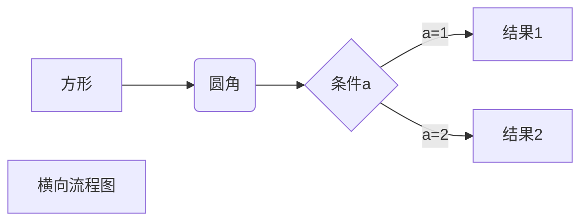
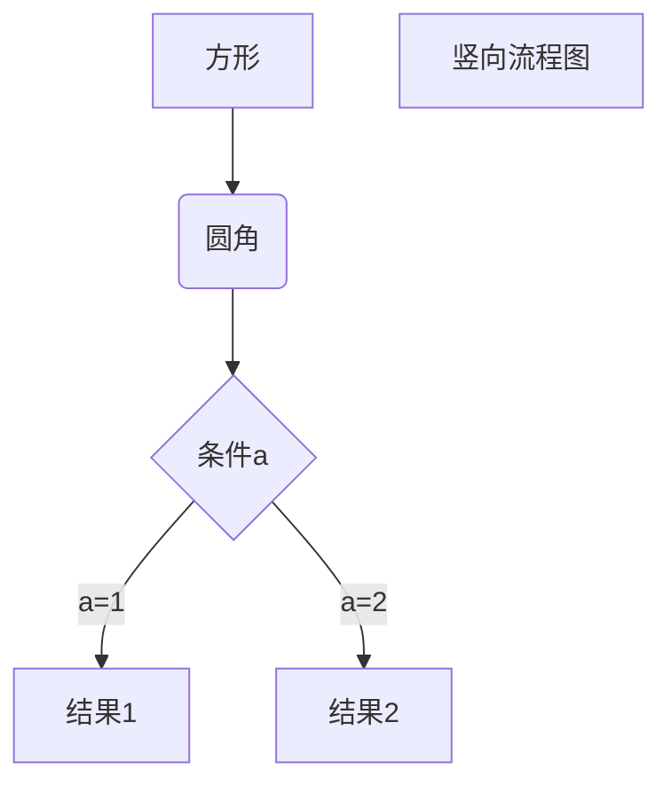
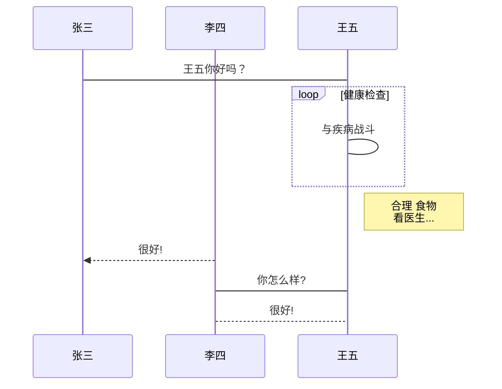
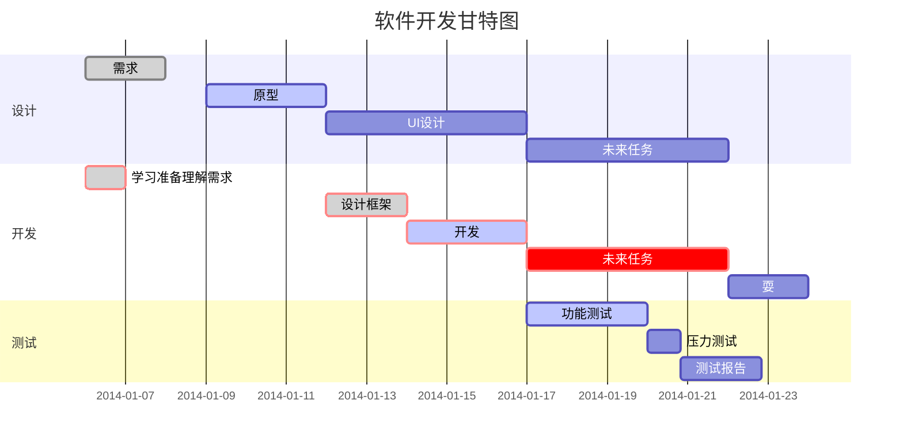

# 重新开始学习markdown语法

## Markdown基本语法：

Markdown是一种轻量级标记语言，排版语法简介，使用易读易洗的纯文本格式编写文档，可与HTML混编，可导出 HTML、PDF 以及本身的 .md 格式的文件。因简洁、高效、易读、易写，Markdown被大量使用。

Markdown 编写的文档可以导出 HTML 、Word、图像、PDF、Epub 等多种格式的文档。 Markdown 编写的文档后缀为 .md, .markdown。

接下来，开始Markdown语法的学习：

## Markdown标题语法：

要创建标题，请在单词或短语前面添加井号 (`#`) ，不同数量的`#`可以完成不同的标题，可表示 1-6 级标题，一级标题对应一个`#`号，二级标题对应两个`#`号，以此类推如下：

```markdown
# 一级标题
## 二级标题
### 三级标题
#### 四级标题
##### 五级标题
###### 六级标题
```

也可以使用`=`和`-`分别标识一级标题和二级标题

```markdown
我展示的是一级标题
=================

我展示的是二级标题
-----------------
```

\#Markdown段落语法：

Markdown 段落没有特殊的格式，直接编写文字就好，**段落的换行是使用两个以上空格加上回车**。

## Markdown强调语法：

通过将文本设置为粗体或斜体来强调其重要性。

#### 粗体：

要**加粗文本**，在单词或短语的前后各添加两个星号`**`或两个下划线`__`。

```markdown
**粗体文本**
__粗体文本__
```

#### 斜体：

要_斜体显示文本_，在单词或短语前后添加一个星号`*`或一个下划线`_`。

```markdown
*斜体文本*
_斜体文本_
```

#### 粗斜体：

要_**斜体加粗文本**_，在单词或短语的前后各添加三个星号`***`或三个下划线`___`。

```markdown
***粗斜体文本***
___粗斜体文本___
```

#### 删除线：

要~~删除线~~，在单词或短语的前后各添加两个波浪线 `~~`。

```markdown
~~删除线~~
```

#### 下划线：

要带下划线文本，在单词或短语的前后各添加 HTML 的 `<u>`标签来实现。

```markdown
<u>下划线</u>
```

#### 脚注：

脚注是对文本的补充说明，Markdown 脚注的格式如下:

```markdown
创建脚注格式类似这样 [^脚注]。
[^脚注]: 脚注是对文本的补充说明
```

## Markdown 引用语法：

要创建块引用，在段落前添加一个 `>` 符号即可。

```
> Dorothy followed her through many of the beautiful rooms in her castle.
```

渲染结果如下：

> Dorothy followed her through many of the beautiful rooms in her castle.

#### 多个段落的块引用：

```
> Dorothy followed her through many of the beautiful rooms in her castle.
>
> The Witch bade her clean the pots and kettles and sweep the floor and keep the fire fed with wood.
```

渲染结果如下：

> Dorothy followed her through many of the beautiful rooms in her castle.
>
> The Witch bade her clean the pots and kettles and sweep the floor and keep the fire fed with wood.

#### 嵌套块引用：

块引用可以嵌套。在要嵌套的段落前添加一个 `>>` 符号。

```
> Dorothy followed her through many of the beautiful rooms in her castle.
>
>> The Witch bade her clean the pots and kettles and sweep the floor and keep the fire fed with wood.
```

渲染效果如下：

> Dorothy followed her through many of the beautiful rooms in her castle.
>
> > The Witch bade her clean the pots and kettles and sweep the floor and keep the fire fed with wood.

#### 带有其它元素的块引用：

块引用可以包含其他 Markdown 格式的元素。并非所有元素都可以使用，你需要进行实验以查看哪些元素有效。

```
> #### The quarterly results look great!
>
> - Revenue was off the chart.
> - Profits were higher than ever.
>
>  *Everything* is going according to **plan**.
```

渲染效果如下：

> **The quarterly results look great!**
>
> * Revenue was off the chart.
> * Profits were higher than ever.
>
> _Everything_ is going according to **plan**.

#### 代码块的引用：

```
1.  Open the file.
2.  Find the following code block on line 21:

        <html>
          <head>
            <title>Test</title>
          </head>

3.  Update the title to match the name of your website.
```

渲染效果如下：

1. Open the file.
2.  Find the following code block on line 21:

    ```
    <html>
      <head>
        <title>Test</title>
      </head>
    ```
3. Update the title to match the name of your website.

#### 带有图片的引用：

```
1.  Open the file containing the Linux mascot.
2.  Marvel at its beauty.

    

3.  Close the file.
```

渲染效果如下：

1. Open the file containing the Linux mascot.
2.  Marvel at its beauty.

    
3. Close the file.

#### 列表的引用：

可以将无序列表嵌套在有序列表中，反之亦然。

```
1. First item
2. Second item
3. Third item
    - Indented item
    - Indented item
4. Fourth item
```

渲染效果如下：

1. First item
2. Second item
3. Third item
   * Indented item
   * Indented item
4. Fourth item

## Markdown 列表语法：

Markdown 支持有序列表和无序列表，可以将多个条目组织成有序或无序列表。

### 无序列表

要创建无序列表，在每个列表项前面添加破折号 (-)、星号 (\*) 或加号 (+) 。缩进一个或多个列表项可创建嵌套列表。

```
- First item
- Second item
- Third item
- Fourth item
每个列表项前面添加破折号 (-)、星号 (*) 或加号 (+)选其一都可实现无序列表
```

渲染效果：

* First item
* Second item
* Third item
* Fourth item

### 有序列表

要创建有序列表，在每个列表项前添加数字并紧跟一个英文句点`.`。数字不必按数学顺序排列，但是列表应当以数字 1 起始。

```
   1. First item
   2. Second item
   3. Third item
   4. Fourth item
```

渲染效果：

1. First item
2. Second item
3. Third item
4. Fourth item

## Markdown 代码语法：

要将单词或短语表示为代码，将其包裹在反引号 (\`\`) 。

```
`printf()` 函数
```

渲染结果： `printf()` 函数

#### 代码区块

代码区块使用 4 个空格或者一个制表符（Tab 键）。

```
    <html>
      <head>
      </head>
    </html>
```

渲染结果： ​

也可以在代码块之前和之后的行上使用三个反引号（(\`\`\`\`\`）或三个波浪号（\~\~\~）。

````
```<html>
 <head>
 </head>
</html>```
````

渲染结果：

​

## Markdown 分隔线语法：

要创建分隔线，在单独一行上使用三个或多个星号 (`***`)、破折号 (`---`) 或下划线 (`___`) ，并且不能包含其他内容

```
***

---

_________________
```

以上三个分隔线的渲染效果看起来都一样，为了兼容性，请在分隔线的前后均添加空白行。

渲染结果：

***

## Markdown 链接语法：

链接文本放在中括号内，链接地址放在后面的括号中，链接title可选。

超链接Markdown语法代码：`[超链接显示名](超链接地址 "超链接title")`

对应的HTML代码：`<a href="超链接地址" title="超链接title">超链接显示名</a>`

```
这是一个链接 [Markdown语法](https://markdown.com.cn)。
```

渲染效果如下： 这是一个链接 [Markdown语法](https://markdown.com.cn)。

#### 给链接增加 Title：

链接title是当鼠标悬停在链接上时会出现的文字，这个title是可选的，它放在圆括号中链接地址后面，跟链接地址之间以空格分隔。

```
这是一个链接 [Markdown语法](https://markdown.com.cn "最好的markdown教程")。
```

渲染效果如下： 这是一个链接 [Markdown语法](https://markdown.com.cn)。

#### 网址和Email地址：

使用尖括号可以很方便地把URL或者email地址变成可点击的链接。

```
<https://www.csl88.top/>
<sl@sl00.top>
```

渲染效果如下： [https://www.csl88.top/](https://www.csl88.top/) [sl@sl00.top](mailto:sl@sl00.top)

#### 带格式化的链接：

强调链接, 在链接语法前后增加星号。 要将链接表示为代码，请在方括号中添加反引号。

```
这是我的网站 **[晚风小站](https://www.csl88.top/)**.
这是 *[我的主页](http://index.csl88.top/)*.
参阅上的部分 [`code`](#code).
```

渲染结果：

这是我的网站 [**晚风小站**](https://www.csl88.top/). 这是 [_我的主页_](http://index.csl88.top/). 参阅上的部分 [`code`](broken-reference).

#### 其他格式的链接：

```
这是我的个人图床 [晚风图床][1]
这是我的个人导航 [导航][导航]
然后在文档的结尾为变量赋值（网址）

  [1]: https://img.wfy.pub/
  [导航]: https://i.csl88.top/
```

渲染结果：

这是我的个人图床 [晚风图床](https://img.wfy.pub/) 这是我的个人导航 [导航](https://i.csl88.top/) 然后在文档的结尾为变量赋值（网址）

## Markdown 图片语法：

要添加图像，使用感叹号 (`!`), 然后在方括号增加替代文本，图片链接放在圆括号里，括号里的链接后可以增加一个可选的图片标题文本。

插入图片Markdown语法代码：``。

对应的HTML代码：``

```

```

渲染结果：


#### 链接图片：

给图片增加链接，将图像的Markdown 括在方括号中，然后将链接添加在圆括号中。

```
[](https://www.csl88.top/)
```

渲染效果如下：

[](https://www.csl88.top/)

## Markdown扩展语法:

一些个人和组织开始通过添加其他元素（例如表，代码块，语法突出显示，URL自动链接和脚注）来扩展基本语法。可以通过使用基于基本Markdown语法的轻量级标记语言，或通过向兼容的Markdown处理器添加扩展来启用这些元素。

### 可用性:

并非所有Markdown应用程序都支持扩展语法元素。您需要检查您的应用程序所使用的轻量级标记语言是否支持您要使用的扩展语法元素。如果没有，那么仍然有可能在Markdown处理器中启用扩展。

## Markdown 表格:

要添加表，使用三个或多个连字符（`---`）创建每列的标题，并使用管道（`|`）分隔每列。您可以选择在表的任一端添加管道。

```
| Syntax      | Description |
| ----------- | ----------- |
| Header      | Title       |
| Paragraph   | Text        |
```

呈现的输出如下所示：

| Syntax    | Description |
| --------- | ----------- |
| Header    | Title       |
| Paragraph | Text        |

单元格宽度可以变化，如下所示。呈现的输出将看起来相同:

```
| Syntax | Description |
| --- | ----------- |
| Header | Title |
| Paragraph | Text |
```

### 对齐:

您可以通过在标题行中的连字符的左侧，右侧或两侧添加冒号（`:`），将列中的文本对齐到左侧，右侧或中心。

```
| Syntax      | Description | Test Text     |
| :---        |    :----:   |          ---: |
| Header      | Title       | Here's this   |
| Paragraph   | Text        | And more      |
```

呈现的输出如下所示：

| Syntax    | Description |   Test Text |
| --------- | :---------: | ----------: |
| Header    |    Title    | Here's this |
| Paragraph |     Text    |    And more |

## Markdown语法高亮:

许多Markdown处理器都支持受围栏代码块的语法突出显示。使用此功能，您可以为编写代码的任何语言添加颜色突出显示。要添加语法突出显示，请在受防护的代码块之前的反引号旁边指定一种语言。

````
```json
{
  "firstName": "John",
  "lastName": "Smith",
  "age": 25
}
```
````

## Markdown 定义列表:

一些Markdown处理器允许您创建术语及其对应定义的_定义列表_。要创建定义列表，请在第一行上键入术语。在下一行，键入一个冒号，后跟一个空格和定义。

```
First Term
: This is the definition of the first term.

Second Term
: This is one definition of the second term.
: This is another definition of the second term.
```

HTML看起来像这样：

```html
<dl>
  <dt>First Term</dt>
  <dd>This is the definition of the first term.</dd>
  <dt>Second Term</dt>
  <dd>This is one definition of the second term. </dd>
  <dd>This is another definition of the second term.</dd>
</dl>
```

呈现的输出如下所示：

!\[image-20230215071816207]\(/Users/action/Library/Application Support/typora-user-images/image-20230215071816207.png)

## Markdown 任务列表语法:

任务列表使您可以创建带有复选框的项目列表。在支持任务列表的Markdown应用程序中，复选框将显示在内容旁边。要创建任务列表，请在任务列表项之前添加破折号`-`和方括号`[ ]`，并在`[ ]`前面加上空格。要选择一个复选框，请在方括号`[x]`之间添加 x

```
- [x] Write the press release
- [ ] Update the website
- [ ] Contact the media
```

呈现的输出如下所示：

* [x] Write the press release
* [ ] Update the website
* [ ] Contact the media

## 自动网址链接:

许多Markdown处理器会自动将URL转换为链接。这意味着如果您输入http://www.example.com，即使您未[使用方括号](https://markdown.com.cn/basic-syntax/links.html)，您的Markdown处理器也会自动将其转换为链接。

```
http://www.example.com
```

呈现的输出如下所示：

http://www.example.com

### 禁用自动URL链接:

如果您不希望自动链接URL，则可以通过将URL表示为带反引号的代码来删除该链接。

```
`http://www.example.com`
```

呈现的输出如下所示：

`http://www.example.com`

## Markdown 高级技巧：

#### 支持的 HTML 元素

不在 Markdown 涵盖范围之内的标签，都可以直接在文档里面用 HTML 撰写。

目前支持的 HTML 元素有：`<kbd> <b> <i> <em> <sup> <sub> <br>`等 ，如：

```
使用 <kbd>Ctrl</kbd>+<kbd>Alt</kbd>+<kbd>Del</kbd> 重启电脑
```


## 画流程图、时序图(顺序图)、甘特图：

以下几个实例效果图如下：

### **1、横向流程图源码格式：**

````

````

渲染效果：


### **2、竖向流程图源码格式：**

````

````

渲染效果：


### **3、标准流程图源码格式：**

````
```flow
st=>start: 开始框
op=>operation: 处理框
cond=>condition: 判断框(是或否?)
sub1=>subroutine: 子流程
io=>inputoutput: 输入输出框
e=>end: 结束框
st->op->cond
cond(yes)->io->e
cond(no)->sub1(right)->op
```
````

渲染效果：

```flow
st=>start: 开始框
op=>operation: 处理框
cond=>condition: 判断框(是或否?)
sub1=>subroutine: 子流程
io=>inputoutput: 输入输出框
e=>end: 结束框
st->op->cond
cond(yes)->io->e
cond(no)->sub1(right)->op
```

### **4、标准流程图源码格式（横向）：**

````
```flow
st=>start: 开始框
op=>operation: 处理框
cond=>condition: 判断框(是或否?)
sub1=>subroutine: 子流程
io=>inputoutput: 输入输出框
e=>end: 结束框
st(right)->op(right)->cond
cond(yes)->io(bottom)->e
cond(no)->sub1(right)->op
```
````

渲染效果：

```flow
st=>start: 开始框
op=>operation: 处理框
cond=>condition: 判断框(是或否?)
sub1=>subroutine: 子流程
io=>inputoutput: 输入输出框
e=>end: 结束框
st(right)->op(right)->cond
cond(yes)->io(bottom)->e
cond(no)->sub1(right)->op
```

### **5、UML时序图源码样例：**

````
```sequence
对象A->对象B: 对象B你好吗?（请求）
Note right of 对象B: 对象B的描述
Note left of 对象A: 对象A的描述(提示)
对象B-->对象A: 我很好(响应)
对象A->对象B: 你真的好吗？
```
````

渲染效果：

```sequence
对象A->对象B: 对象B你好吗?（请求）
Note right of 对象B: 对象B的描述
Note left of 对象A: 对象A的描述(提示)
对象B-->对象A: 我很好(响应)
对象A->对象B: 你真的好吗？
```

### **6、UML时序图源码复杂样例：**

````
```sequence
Title: 标题：复杂使用
对象A->对象B: 对象B你好吗?（请求）
Note right of 对象B: 对象B的描述
Note left of 对象A: 对象A的描述(提示)
对象B-->对象A: 我很好(响应)
对象B->小三: 你好吗
小三-->>对象A: 对象B找我了
对象A->对象B: 你真的好吗？
Note over 小三,对象B: 我们是朋友
participant C
Note right of C: 没人陪我玩
```
````

渲染效果：

```sequence
Title: 标题：复杂使用
对象A->对象B: 对象B你好吗?（请求）
Note right of 对象B: 对象B的描述
Note left of 对象A: 对象A的描述(提示)
对象B-->对象A: 我很好(响应)
对象B->小三: 你好吗
小三-->>对象A: 对象B找我了
对象A->对象B: 你真的好吗？
Note over 小三,对象B: 我们是朋友
participant C
Note right of C: 没人陪我玩
```

### **7、UML标准时序图样例：**

````

````

渲染效果：


### **8、甘特图样例：**

````

````

渲染效果：


## 结尾：

本次markdown教程是第二次编写，\~\~本文任然缺少一部分关于markdown扩展语法的教程例如：思维导图，甘特图，公式等内容。\~\~已根据上次编写的markdown教程摘录。

此次教程参考内容主要源于：https://markdown.com.cn/intro.html

此次教程参考内容主要源于：https://www.runoob.com/markdown/md-tutorial.html

上篇教程地址：https://www.csl88.top/archives/766/
